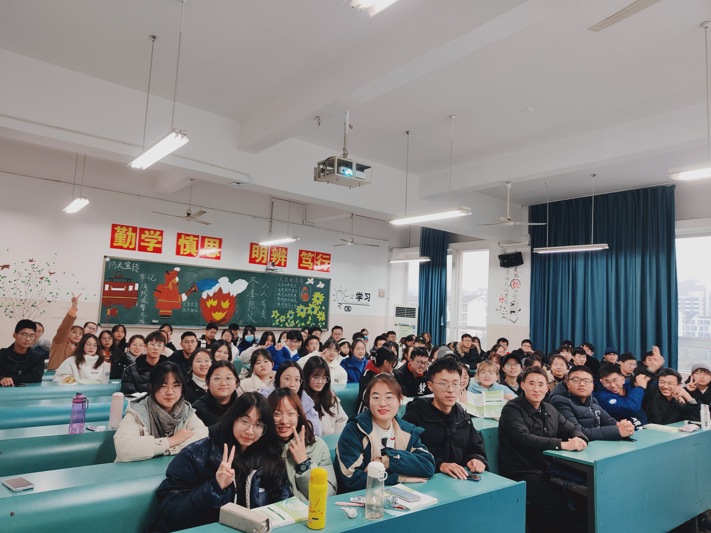
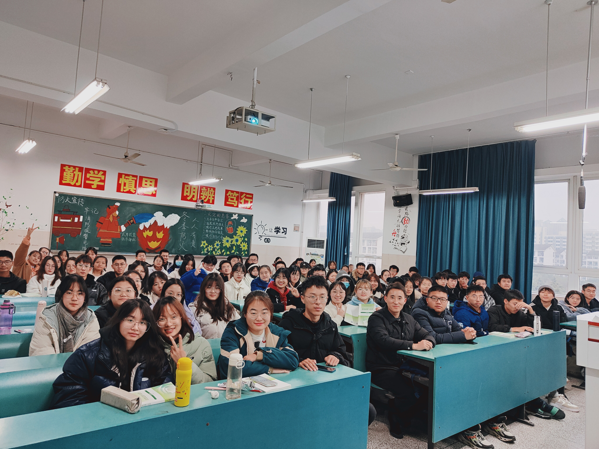

### 观《圆明园》有感

今天老师带我们观看了CCTV拍的一部关于圆明园的的纪录片，让我们共同见证了圆明园由璀璨明珠到一片废墟的辛酸史。

>
>
>

这铁铮铮的事实摆在眼前，让我深有感触。曾几何时，我们的大清王朝也是这个世界上首屈一指的强国。经济，文化，教育，军事等各方面都遥遥领先于世界，圆明园更是我国古代辉煌文化成就的一个缩影。

影片从意大利人郎世宁的角度切入，描述了清朝皇家园林圆明园从初建到大规模扩建成旷世园林，再到英法联军对这座人间仙境的破坏、焚烧的发展历史。

圆明园建在一个康熙皇帝赐给他四子的一座明代私园的旧址上，当四子正式的成为雍正皇帝之后，将其扩建为皇帝长期居住的离宫。“圆”是人格的圆满，“明”是政绩的光辉，寄托了自古以来明君贤臣的政治思想。在乾隆时期，大清帝国拥有空前的财富，史无前例的圆明园就是在这样的背景下诞生的。在圆明园的建设过程中，郎世宁决定设计用十二生肖青铜器作为喷泉“开关”，而这个来自西洋的“大水法”也引得宫中之人竞相观赏。但在喷泉建成后仅仅三年，提水机械就被废弃，改为人工打水，这条废令来自乾隆。在他看来，这些西洋器物只是用来娱乐消遣的雕虫小技，科学等于玩物丧志。而这仅仅是大清帝国闭关锁国，政治腐败的冰山一角。

世界正在大变，而身处圆明园的皇帝全浑然不知，沉醉在自己的丰功伟绩之中。英国通过1689年的光荣革命，进入了资本主义社会，随后1776年，美国独立，1789年法国资产阶级大革命爆发，他们迅速的完成工业革命。1840年，鸦片战争开始，英国殖民者通过大炮打开了中国的大门，中国开始进入半殖民地半封建社会。

1860年8月，英法联军攻入北京。

10月6日，占领圆明园。

10月7日，抢劫，破坏。

10月18日，纵火，焚烧。

当我看到清军面对英法联军“自杀式”的防守时；看到英法联军掠夺圆明园宝物时；看到往日如仙境般的圆明园被烈火与浓烟吞没时，悲愤久久不能平息。自甘堕落的大清王朝啊，简直受够了侮辱！

在影片最后有这样一段话“圆明园是一座名副其实的东方博物馆，其中究竟藏有多少珍宝和文物已无从知晓。今天，圆明园是一座遗址公园。”对圆明园的毁灭看似轻描淡写，实际引人深思。

圆明园的焚毁警示着每一个中国人：闭关必然落后，落后就要挨打。圆明园的焚毁警示着每一个中国人：闭关必然落后，落后就要挨打。

---

2021年12月24日1
今日结束了最后一节思政课，结束的时候，老师和我们留了个影。

