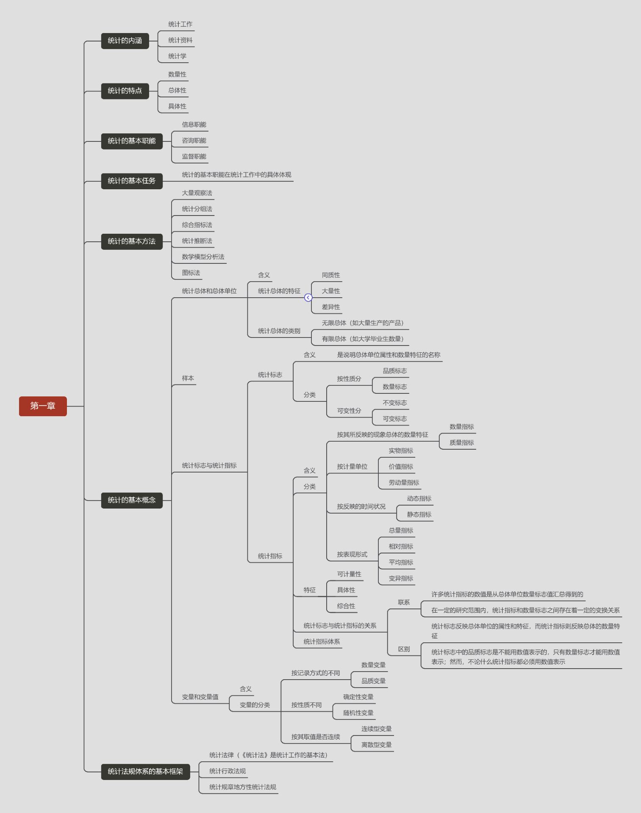
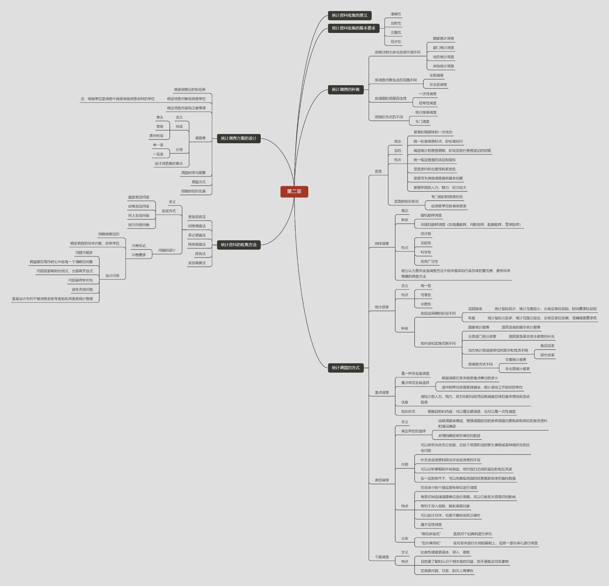
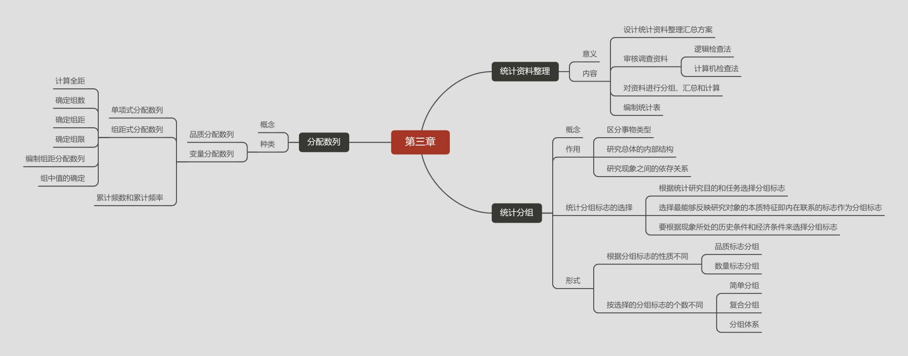
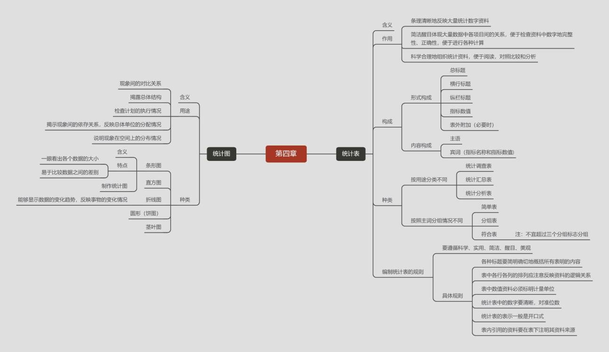

第六章 集中趋势与离散程度的测定
====
[TOC]
>#### 1. 算数平均数 $\overline x$
>#### 2. 调和平均数 H
>#### 3. 几何平均数 G
>
>#### 4. 中位数 $M_e$
>#### 5. 众数 $M_o$
>
>
>
>
---

## 第一节 平均指标的概念与作用
#### 一、概念：
>平均指标：指同类社会经济现象总体内各单位某一数量标志在一定时间、地点和条件下数量差异抽象化的代表性水平指标，其数值表现为平均数，具有单位名称，其计量单位与标志值的计量单位一致
#### 二、作用：
>1.可以了解总体次数分布的集中趋势；
2.可以对若干同类现象在不同单位、地区间进行比较研究；
3.可以研究某一总体数值的平均水平在时间上的变化，说明总体的发展过程和趋势；
4.可以分析现象之间的依存关系；
5.可以作为某些科学预测、决策和某些推算的依据.

#### 三、种类
1. 按计算方法
* 数值平均数
* 位置平均数
2. 按时间状况不同
* 静态平均数
* 动态平均数
---
## 第二节 算数平均数
#### 一、算数平均数的基本形式
>算数平均数=$\frac {总体标志总量}{总体单位总数}$

#### 二、算数平均数的计算方法：$\overline x$

#### （一）简单算术平均数

* 计算公式：

简单算术平均数=$\frac {各单位标志值之和}{总体单位总数}$（应用条件：资料未分组）

>$\overline x = \frac {x_1+x_2+\cdots+x_n}{n}=\frac {\sum x}{n}$

#### （二）加权算术平均数

* 计算公式：

加权算术平均数=$\frac {各组标志值与该组单位数乘积的总和}{各组单位数的总和}$（应用条件：单项式分组，各组次数不同）

>$\overline x = \frac {x_1f+x_2f+\cdots+x_nf}{\sum f}=\frac {\sum xf}{\sum f}$

几种特殊平均数
1. 是非平均数： 把具有某种特征的用“1”表示，不具有该种特征的用“0”表示。
2. 评分平均数：通常把人们对评价项目的评分组作为x,把事先规定的项目重要程度作权数f。
3. 等级平均数
4. 先进平均数：比算术平均数大的数求平均。
5. 截尾平均数：将数据分成四组，去掉首尾。

#### （三）算术平均数的性质

1. 各个变量值与其平均数离差之和等于零
$\sum (x - \overline{x}) = 0$ 
$\sum (x - \overline{x})f = 0$
2. 各个变量值与其平均数离差平方之和为最小值
$\sum (x - \overline{x})^2 = 最小值$
$\sum (x - \overline{x})^2f = 最小值$
>设$x_0 \neq x \ \ \ \ \ \ \ \ \ x_0=\overline{x}-c$
$$
\begin{aligned}
\sum (x - x_0)^2 & = \sum [x - (\overline x - c)]^2 \\
& = \sum [(x - \overline{x}) + c]^2 \\
& = \sum (x - \overline{x})^2 + 2c\sum (x - \overline{x}) +nc^2 \\
& = \sum (x - \overline{x})^2 + nc^2\\
& \because nc^2 \geq 0 \\
& \therefore \sum (x - x_0)^2 \geq \sum (x - \overline{x})^2 \\
& \therefore \sum (x - \overline{x})^2为最小值
\end{aligned}
$$
---
## 第三节 调和平均数(H)

#### 一、概念：
>变量值倒数得算数平均数的倒数，又称倒数平均数.

#### 特点：
>用特定的权数$(m=xf)$加权,其变量值多为相对数和平均数。

#### 二、简单调和平均数
* 计算公式：
$$H = \frac {n}{{1 \over x_1} + {1 \over x_2} + \cdots +{1 \over x_n}} = \frac {n}{\sum {1 \over x}}$$
* 应用条件：资料未分组，各个变量值次数都是1

#### 三、加权调和平均数
* 计算公式：
$$H = \frac {m_1 + m_2 + \cdots + m_n}{{m_1 \over x_1} + {m_2 \over x_2} + \cdots + {m_n \over x_n}} = \frac {\sum m}{\sum {m \over x}}$$
* 应用条件：资料分组，各组次数不同
---
## 第四节 几何平均数(G)
#### 一、简单几何平均
* 计算方法
$$G = \sqrt[n]{x_1 x_2 \cdots x_n} = \sqrt[n]{\prod x}$$
* 应用条件：资料未分组，各变量值次数是1

#### 二、加权几何平均
* 计算方法
$$G = \sqrt[\sum f]{x_1^{f_1} x_2^{f_2} \cdots x_n^{f_n}} = \sqrt[\sum f]{\prod x^f}$$
* 资料经过分组，各组次数不同
---
## 第五节 众数和中位数
#### 一、众数($M_o$)
##### 1. 由未分组资料确定众数
>出现次数最多的数
##### 2. 由单项数列确定众数
|按日产量分组（件）|工人数（人）|
|:--:|:--:|
|20|15|
|21|30|
|22|20|
|23|10|
$M_o = 21(件)$
##### 3. 由组距数列确定众数
$$
\begin{aligned}
M_{0}=& L+\frac{f_{0}-f_{-1}}{\left(f_{0}-f_{-1}\right)+\left(f_{0}-f_{+1}\right)} \times i \\
&=L+\frac{\Delta_{1}}{\Delta_{1}+\Delta_{2}} \times i \text { (下 限 公 式) }
\end{aligned}
$$
$$
\begin{aligned}
M_{0}=& U-\frac{f_{0}-f_{+1}}{\left(f_{0}-f_{-1}\right)+\left(f_{0}-f_{+1}\right)} \times i \\
&=U-\frac{\Delta_{2}}{\Delta_{1}+\Delta_{2}} \times i \quad(\text { 上限 公式 })
\end{aligned}
$$
#### 二、中位数($M_e$)
##### 1. 由未分组资料确定中位数：先排序$X_1, X_2 , \dots , X_n $
$$
\boldsymbol{M}_e = 
\begin{cases}
\frac {{X_{n \over 2}} + {X_{\left({n \over 2} + 1\right)}}}{2}, & n 为偶数\\
X_{n+1 \over 2}, & n 为奇数
\end{cases}
$$
##### 2. 由单项数列确定中位数：中点位置$\sum f \over 2$, 该位置所在组就是中位数。
##### 3. 由组距数列确定中位数
1. 确定中位数所在组$\sum f \over 2$
2. 计算公式
$$
\boldsymbol{M}_{e}=\boldsymbol{L}+\frac{\frac{\sum f}{2}-\boldsymbol{s}_{m-1}}{\boldsymbol{f}_{m}} \times \boldsymbol{i}(\text { 下限公式 })
$$
$$
\boldsymbol{M}_{e}=\boldsymbol{U}-\frac{\frac{\sum f}{2}-\boldsymbol{s}_{m+1}}{f_{m}} \times \boldsymbol{i}(\text { 上限公式 })
$$
#### 三、四分位数($Q$)
$$
未分组数据：
\begin{cases}
下四分位数(Q_L)位置 =\frac {N + 1}{4}\\
上四分位数(Q_U)位置=\frac {3(N + 1)}{4}
\end{cases}
$$
$$
组距分组数据：
\begin{cases}
下四分位数(Q_L)位置 = \frac {N}{4}\\
上四分位数(Q_U)位置 = \frac {3N}{4}
\end{cases}
$$

数值型分组数据的四分位数(计算公式)
* 下四分位数：$$Q_{L} = L_{L}+\frac{\frac{N}{4}-S_{L}}{f_{L}} \times i_{L}$$
* 上四分位数：$$Q_{U} \doteq L_{U}+\frac{\frac{3 N}{4}-S_{U}}{f_{U}} \times i_{U}$$
---
## 第六节标志变异指标
#### 一、作用
1. 可以衡量平均数代表性的大小；

2. 可以反映社会经济活动过程节奏性和均衡性；

3. 可以反映总体单位标志值的均匀性和稳定性；
   $$
   
   $$
   
4. 是科学地确定必要抽样单位数应考虑的重要因素.

#### 二、绝对数形式

##### 1. 全距($R$)

* $公式：R = 最大值 - 最小值 \\或 \,最高组的上限 - 最低组的下限$ 

##### 2. 四分位差

* 公式：$$Q_D = \frac{\left( Q_U - Q_L \right)}{2}$$

##### 3.平均差(A.D)

* 公式：$$\mathbf{A} . \mathbf{D}=\frac{\sum |\mathbf{x}-\overline{\mathbf{x}}|}{\mathbf{n}}$$
##### 4. 加权平均差
* 公式：$$\mathbf{A} . \mathbf{D}=\frac{\sum|\mathbf{x}-\overline{\mathbf{x}}| \mathbf{f}}{\sum \mathbf{f}}$$
##### 5. 标准差 $\sigma$
* 公式：
$$
\sigma=\sqrt{\frac{\sum(\mathrm{x}-\overline{\mathrm{x}})^{2}}{\mathrm{n}}}=\sqrt{\frac{\sum \mathrm{x}^{2}}{\mathrm{n}}-\left(\frac{\sum \mathrm{x}}{\mathrm{n}}\right)^{2}}
$$
##### 6. 加权标准差

* 公式：
$$
\sigma=\sqrt{\frac{\sum(\mathrm{x}-\overline{\mathrm{x}})^{2} \mathrm{f}}{\sum \mathrm{f}}}=\sqrt{\frac{\sum \mathrm{x}^{2} \mathrm{f}}{\sum \mathrm{f}}-\left(\frac{\sum \mathrm{xf}}{\sum \mathrm{f}}\right)^{2}}
$$
##### 7.是非标志的标准差

* 公式：
$$
\begin{aligned}
\sigma_{\text {是 }} &=\sqrt{\frac{(1-\mathrm{P})^{2} \mathrm{~N}_{1}+\mathrm{P}^{2} \mathrm{~N}_{0}}{\mathrm{~N}}} \\
&=\sqrt{\mathrm{P}(1-\mathrm{P})}
\end{aligned}
$$

|标志值x|单位数f|$(x - \overline x)^2 f$|
|:-:|:-:|:-:|
|1|$N_1$|$(1-P)^2 N_1$|
|0|$N_0$|$(0-P)^2 N_0$|
|合计|$\boldsymbol{N}$|$(1-P)^{2} N_{1}+P^{2} N_{0}$|

##### 8. 标准差系数

* 公式:$$ V_{\sigma} = \frac {\sigma}{\overline x}$$

---

